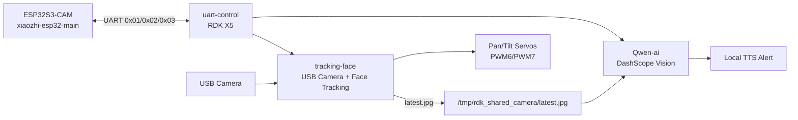

<div align="center">

# 🤖 Monitoring Robot

### RDK X5 + ESP32S3-CAM 驾驶员安全监督机器人

<p>
  <a href="#-quick-start"></a>
  <a href="#-modules"></a>
  <a href="#-hardware"></a>
  <a href="#-license"></a>
</p>

<p>
  <a href="#-overview">Overview</a> •
  <a href="#-features">Features</a> •
  <a href="#-architecture">Architecture</a> •
  <a href="#-quick-start">Quick Start</a> •
  <a href="#-docs">Docs</a>
</p>

</div>

---

## 📌 Overview

**Monitoring Robot** 是一个基于 **RDK X5** 与 **ESP32S3-CAM** 的驾驶员安全监督机器人项目。系统通过 USB 摄像头做人脸追踪与云端视觉识别，在检测到闭眼、玩手机、喝水、愤怒等异常驾驶行为时播放本地语音提醒，并可通过 ESP32S3-CAM 与 RDK X5 之间的 UART 命令启动或停止监控流程。

本仓库由四个子项目组成：

- `Qwen-ai`、`tracking-face`、`uart-control` 运行在 **RDK X5**。
- `xiaozhi-esp32-main` 编译后烧录到 **ESP32S3-CAM**。

更细的参数、引脚、模型、滤波与通信实现都在各子项目源码和 README 中，顶层 README 只保留 GitHub 展示与快速部署路径。

## ✨ Features

| Icon | 能力 | 说明 |
| --- | --- | --- |
| 👀 | 人脸追踪 | `tracking-face` 使用 USB 摄像头 + OpenCV / YuNet 检测人脸，并控制 RDK X5 PWM6/PWM7 舵机云台 |
| 🧠 | 视觉识别 | `Qwen-ai` 调用阿里云 DashScope 视觉模型识别驾驶行为 |
| 🔊 | 语音告警 | 检测到异常分类后，从本地 `tts/` 目录随机播放对应提示音 |
| 📷 | 共享摄像头 | `tracking-face` 独占摄像头并发布 `/tmp/rdk_shared_camera/latest.jpg`，`Qwen-ai` 读取共享帧 |
| 🔌 | UART 控制 | `uart-control` 监听 RDK X5 40Pin UART，根据 ESP32S3-CAM 命令编排启动/停止 |
| 🗣️ | 小智语音端 | `xiaozhi-esp32-main` 提供小智 AI 固件能力，支持语音交互、MCP、Wi-Fi 等功能 |

## 🧩 Modules

| 模块 | 运行平台 | 入口 | 主要职责 |
| --- | --- | --- | --- |
| `tracking-face` | RDK X5 | `tracking_face.py` | 摄像头采集、人脸检测、舵机追踪、共享帧发布 |
| `Qwen-ai` | RDK X5 | `driver_safety_supervisor.py` | DashScope 视觉分类、异常判断、语音告警 |
| `uart-control` | RDK X5 | `uart_control.py` | 监听 UART 命令，管理 `tracking-face` 与 `Qwen-ai` 子进程 |
| `xiaozhi-esp32-main` | ESP32S3-CAM | ESP-IDF 工程 | 编译烧录到 ESP32S3-CAM，作为小智语音与控制端 |

## 🏗️ Architecture



推荐的运行关系是：`tracking-face` 独占 USB 摄像头并发布共享帧，`Qwen-ai` 只读取共享 JPEG。这样高帧率人脸追踪和低频云端视觉识别可以同时工作，不会争抢 `/dev/video0`。

## 🛠️ Hardware

### RDK X5 侧

| 设备 | 连接/用途 |
| --- | --- |
| USB 摄像头 | 默认 `/dev/video0`，由 `tracking-face` 使用 |
| 舵机云台 | PWM6 / BOARD 32 控制俯仰，PWM7 / BOARD 33 控制水平 |
| UART | BOARD 8 为 `UART_TXD`，BOARD 10 为 `UART_RXD` |
| GND | RDK X5、外部舵机电源、ESP32S3-CAM 需要共地 |
| 外部 5V 电源 | 建议舵机独立供电，避免 RDK X5 供电波动 |

### ESP32S3-CAM 侧

`xiaozhi-esp32-main` 中的目标板卡为 `bread-compact-wifi-s3cam`，硬件基于 ESP32S3-CAM，摄像头为 OV2640。摄像头、音频、显示等具体引脚定义见：

```text
xiaozhi-esp32-main/main/boards/bread-compact-wifi-s3cam/config.h
```

## ⚡ Quick Start

### 1. RDK X5: 部署 Qwen-ai

```bash
cd /home/sunrise/Desktop/Qwen-ai
python3 -m venv .venv
source .venv/bin/activate
pip install -r requirements.txt
```

编辑 `.env`，至少填入：

```bash
DASHSCOPE_API_KEY=你的 DashScope API Key
CAMERA_SOURCE=shared_jpeg
SHARED_FRAME_PATH=/tmp/rdk_shared_camera/latest.jpg
```

安装至少一个音频播放工具：

```bash
sudo apt update
sudo apt install -y ffmpeg alsa-utils pulseaudio-utils
```

### 2. RDK X5: 调试人脸追踪

```bash
cd /home/sunrise/Desktop/tracking-face
python3 tracking_face.py --dry-run --show
```

确认摄像头与检测正常后，启动舵机控制：

```bash
python3 tracking_face.py
```

桌面环境下可加 `--show` 查看预览窗口；SSH 或无图形环境不要加。

### 3. RDK X5: 手动联动运行

先启动人脸追踪并发布共享帧：

```bash
cd /home/sunrise/Desktop/tracking-face
python3 tracking_face.py --publish-frame /tmp/rdk_shared_camera/latest.jpg
```

再启动驾驶行为识别：

```bash
cd /home/sunrise/Desktop/Qwen-ai
source .venv/bin/activate
python driver_safety_supervisor.py
```

### 4. RDK X5: 使用 UART 控制

```bash
cd /home/sunrise/Desktop/uart-control
python3 uart_control.py --port /dev/ttyS1 --baudrate 115200
```

串口命令：

| 命令 | 行为 |
| --- | --- |
| `0x01` | 先启动 `tracking-face`，等待共享帧，再启动 `Qwen-ai` |
| `0x02` | 停止 `tracking-face` 和 `Qwen-ai` |
| `0x03` | 只停止 `Qwen-ai`，保留人脸追踪 |

安装为 systemd 服务：

```bash
sudo cp /home/sunrise/Desktop/uart-control/uart-control.service /etc/systemd/system/
sudo systemctl daemon-reload
sudo systemctl enable uart-control.service
sudo systemctl start uart-control.service
```

查看日志：

```bash
journalctl -u uart-control.service -f
```

### 5. ESP32S3-CAM: 编译烧录 xiaozhi-esp32-main

进入 ESP-IDF 环境后执行：

```bash
cd xiaozhi-esp32-main
idf.py set-target esp32s3
idf.py menuconfig
```

在 `menuconfig` 中选择：

```text
Xiaozhi Assistant -> Board Type -> Bread Compact WiFi + LCD + Camera (面包板)
```

然后编译并烧录到 ESP32S3-CAM：

```bash
idf.py build flash monitor
```

如果你的开发环境或端口需要指定，可使用 ESP-IDF 常规参数，例如：

```bash
idf.py -p /dev/ttyUSB0 build flash monitor
```

## ⚙️ Configuration

### Qwen-ai 常用环境变量

| 变量 | 说明 | 默认/建议 |
| --- | --- | --- |
| `DASHSCOPE_API_KEY` | DashScope API Key | 必填 |
| `VISION_MODEL` | 视觉模型 | `.env` 中默认 `qwen3.6-flash` |
| `CAMERA_SOURCE` | 图像来源 | 联动运行建议 `shared_jpeg` |
| `SHARED_FRAME_PATH` | 共享帧路径 | `/tmp/rdk_shared_camera/latest.jpg` |
| `CAPTURE_INTERVAL_SEC` | 抓拍周期 | `1` |
| `INFER_MIN_INTERVAL_SEC` | 最小推理间隔 | `1` 或按网络延迟调整 |
| `REQUEST_TIMEOUT_SEC` | 云端请求超时 | `.env` 中默认 `8` |
| `TTS_DIR` | 本地语音目录 | `tts/` |

异常类别固定为：

```text
normal | angry | eyes_closed | phone_use | drinking
```

本地语音目录需要包含：

```text
tts/angry/
tts/eyes_closed/
tts/phone_use/
tts/drinking/
```

## 🧪 Troubleshooting

| 现象 | 检查项 |
| --- | --- |
| 找不到摄像头 | 执行 `ls -l /dev/video*`、`v4l2-ctl --list-devices`、`dmesg | grep -iE 'uvc|video'` |
| 两个程序抢摄像头 | 确保 `Qwen-ai/.env` 使用 `CAMERA_SOURCE=shared_jpeg` |
| 无语音播放 | 检查 `ffplay`、`aplay`、`paplay` 等播放器是否安装 |
| 舵机方向反了 | `tracking_face.py` 支持 `--normal-pan`、`--invert-tilt` |
| SSH 下预览报错 | 不要加 `--show`，只在桌面图形环境启用预览窗口 |
| UART 无响应 | 检查 `/dev/ttyS1`、波特率 `115200`、TX/RX 是否交叉连接、GND 是否共地 |

## 📚 Docs

| 文档 | 内容 |
| --- | --- |
| [`Qwen-ai/README.md`](Qwen-ai/README.md) | 驾驶行为识别、DashScope、共享帧、语音告警 |
| [`tracking-face/README.md`](tracking-face/README.md) | RDK X5 人脸追踪、PWM 舵机、调参 |
| [`uart-control/README.md`](uart-control/README.md) | UART 命令、systemd 自启动 |
| [`xiaozhi-esp32-main/README_zh.md`](xiaozhi-esp32-main/README_zh.md) | 小智 AI ESP32 固件说明 |
| [`xiaozhi-esp32-main/main/boards/bread-compact-wifi-s3cam/README.md`](xiaozhi-esp32-main/main/boards/bread-compact-wifi-s3cam/README.md) | ESP32S3-CAM 板卡编译与接线说明 |

## 🤝 Contributing

欢迎提交 Issue 或 Pull Request。建议在修改前先阅读对应子模块 README，并尽量保持每个模块的职责边界清晰：

- RDK X5 侧负责视觉计算、舵机控制和串口编排。
- ESP32S3-CAM 侧负责小智固件、语音交互和外设入口。

## 📄 License

- `Qwen-ai`、`tracking-face`、`uart-control` 为作者原创项目，采用 **MIT License** 开源。
- `xiaozhi-esp32-main` 源自小智 AI ESP32 开源项目，其许可证、版权归属与使用说明请以原项目的 `README` 和 `LICENSE` 文件为准。
